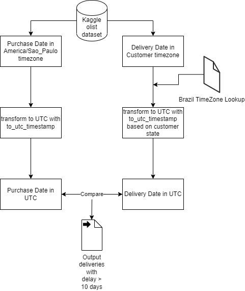

# spark-scala
Using Kaggle Olist Dataset to determine late deliveries

## Project Overview

The Goal of the project is to find deliveries that are late by more than 10 days in the Kaggle Olist Dataset. This way, a marketing department can provide a 10% discount for those deliveries and boost the sales.
The project is implemented using Scala and Spark.

The difficult part is that the Delivery Date is stored in the customers timezone and brazil has several timezones. The Purchase Date is in Sao Paulo timezone.

## Architecture

- I decided to transform the necessary timestamps for comparison into UTC time. 
- The Spark SQl Library provides a to_utc_timestamp function that takes in a timestamp as well as a timezone and transforms it to UTC.
- The big advantage is that it automatically respects DST because some of the brazilian timezones use DST.
- To know which customer (and thus which order) is in which timezone, I am using a small lookup file. Luckily, each state in Brazil has only 1 timezone.
- So I looked up the 27 different customer_state and their respective timezone from http://www.statoids.com/tbr.html and put it to a csv file

- In the end, the UTC Timestamps of the purchase date and delivery date are compared with the datediff function and all delivery delays > 10 days are output to a csv file.

See the Architecture here:

## Environment

Code was written in Scala on Visual Studio Code. Mill was used as the build tool

https://code.visualstudio.com
https://scalameta.org/metals/docs/editors/vscode/
https://github.com/com-lihaoyi/mill

## How to reproduce locally
