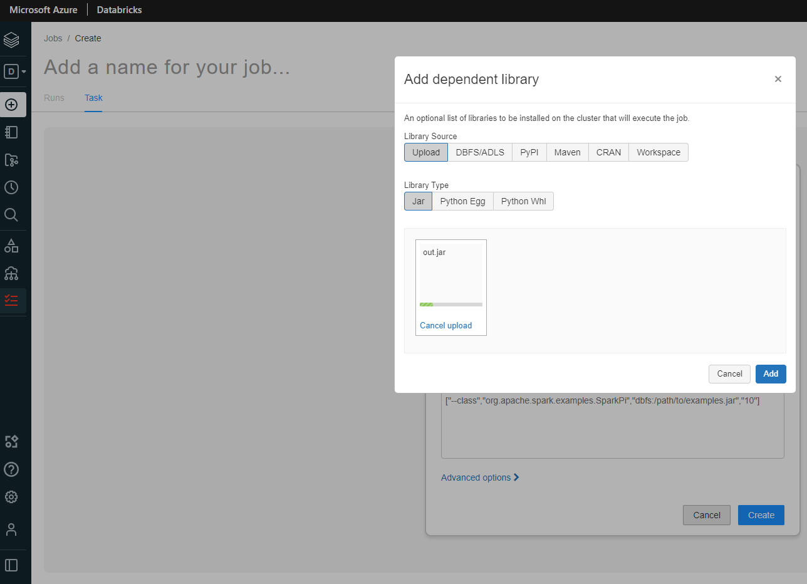

# spark-scala
Using Kaggle Olist Dataset to determine late deliveries

Results available at 

https://clicklearn.gawert.de/d/zz3dyd0nz/olist-dashboard?orgId=1&from=1640923673755&to=1640945273756

username: olist

password: olist

## Project Overview

The Goal of the project is to find deliveries that are late by more than 10 days in the Kaggle Olist Dataset. This way, a marketing department can provide a 10% discount for those deliveries and boost the sales.
The project is implemented using Scala and Spark.

The difficult part is that the Delivery Date is stored in the customers timezone and brazil has several timezones. The Purchase Date is in Sao Paulo timezone.

## Architecture

- I decided to transform the necessary timestamps for comparison into UTC time
- The Spark SQL Library provides a to_utc_timestamp function that takes in a timestamp as well as a timezone and transforms it to UTC
- The big advantage is that it automatically respects DST because some of the brazilian timezones use DST
- To know which customer (and thus which order) is in which timezone, I am using a small lookup file. Luckily, each state in Brazil has only 1 timezone
- So I looked up the 27 different customer_state and their respective timezone from http://www.statoids.com/tbr.html and put it to a csv file

- In the end, the UTC Timestamps of the purchase date and delivery date are compared and all delivery delays > 10 days are output to a csv file
- For comparison, I am using exact unix timestamps and a delivery is counted as delayed, if difference is bigger than 10.00
- This means that a delivery that is late by exctly 10 days and 1 second, it will already be counted
- depending on required business logic this can be changed to use datediff and compare only whole days. The difference is around 3.3K deliveries (46,6K vs 49,9K)

See the Architecture here:

## Environment

The Code was written in Scala on Visual Studio Code. Mill was used as the build tool

- https://code.visualstudio.com
- https://scalameta.org/metals/docs/editors/vscode/
- https://github.com/com-lihaoyi/mill

## How toview the results

As the target audience is a marketing/sales department, the easiest way to retrieve the results is by logging in to a grafana dashboard that I created.

https://clicklearn.gawert.de/d/zz3dyd0nz/olist-dashboard?orgId=1&from=1640923673755&to=1640945273756

username: olist

password: olist

Here you can view the results, order by specific columns and more.

You can also download the csv file from

https://github.com/gawertm/spark-scala/blob/main/results/part-00000-cd20baee-355e-4ca5-b784-61ee57617157-c000.csv

For more tech-savvy people, you can try to run the code and produce the results yourself:

### Using Spark

- You will need a working Spark setup on your system as well as git
    
    https://phoenixnap.com/kb/install-spark-on-windows-10
    https://computingforgeeks.com/how-to-install-apache-spark-on-ubuntu-debian/

    https://git-scm.com/downloads

- To avoid version problem, best to use Spark 3.1.2 and Hadoop 2.7
- Then you have to clone the github repository in a terminal with 

    git clone https://github.com/gawertm/spark-scala.git

- Once Spark and Hadoop and the repo are setup properly, you just have to build the application
- For this, install mill following this instruction or on windows execute the mill.bat file from the repository. 
- Then from a terminal in the same directory run:

    mill -i olist.assembly

- Now you can start to run the Application with spark-submit
- The application will create a "results" folder in your current working directory, so best to open a temrinal from the folder you want the results in

Then run the following following command:

    spark-submit --class OlistCli C:\Users\gawertm\source\repos\spark-scala\out.jar

- Replace the path by the location of the out.jar file that was jsut created during assembly step
- If you are on windows, there is a know Spark Issue on windows (https://issues.apache.org/jira/browse/SPARK-12216)
- To avoid this issue make the folder C:\Users\{YourUserID}\AppData\Local\Temp writable by everyone

### Alternative 1: mill standalone run:

- If Spark-submit or the jar assembly is not working, e.g. on windows. you can use mill to run the app as standalone
- For this, execute the mill.bat file in the cloned repository

Then run the following command from a terminal in this directory:

    mill -i olist.standalone.run

### Alternative 2: Run on Databricks Cluster (e.g. on AWS or Azure)

If the other solutions do not work, you can also run a Spark job on a databricks job cluster in the cloud.

Here you will find the instructions for Microsoft Azure:

- create a Microsoft Azure account and add a credit card for a pay-as-you-go subscription
- you will get 200 $USD free credits, so no costs will occur

https://azure.microsoft.com/en-us/free/

- once you are in the Azure portal, you have to create a Databricks Workspace as described here:

https://docs.microsoft.com/en-us/azure/databricks/scenarios/quickstart-create-databricks-workspace-portal?tabs=azure-portal#create-an-azure-databricks-workspace

- Afterwards you will have to create a new Job. A databricks job cluster will be automatically created during the setup
- Once you launched Databricks workspace , you will find "New Job" on the Homepage under Common Tasks. Click on it
- Provide a meaningful task name like "Olist Deliveries" As Type, Choose "JAR"
- Click on "Add" to upload a Jar file that was either created during assembly step or is available at:

- Use "OlistCli" as Main Class. The rest you can leave as defaults

